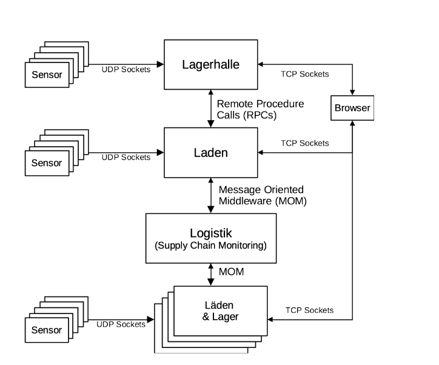
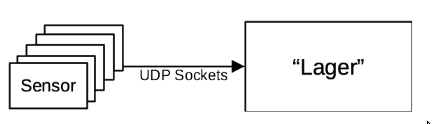
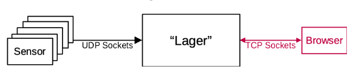

# Verteilte Systeme in Wintersemester 2021/22

## Getting Started

The easiest way to run the projekt is by using `docker-compose`

```
docker-compose up -d --build
```

## Assignment

in the context of this course we are designing a distributed system for "Supply Chain Monitoring".
Below you can find a diagram of the full project we are buidling. The goal is not to build the most
realistic supply chain monitoring but rather to focus on the communication of the distributed system,
the system design, the tests and the deployment of the application.



## Project Structure


* `build/`: defines the infrastructure
  * `<service-name>/`: define a Dockerfile for the concrete service.
* `cmd/`: entrypoints
  * `<service-name>/`: primary entrypoint for this service - short main functions.
* `internal/`: defines the _core domain_.
  * `<service-name>/`: concrete implementation of the service - source code.
* `pkg/`: code that is used by multiple services.
* `tests/`: describtions of test cases.

<<<<<<< HEAD
## Flow-Diagram


## Functional Requirements

Hier könnte ihre Werbung stehen

## Non-Functional Requirements

Hier könnte ihre Werbung stehen

## Realisierung

Hier könnte ihre Werbung stehen

## Testumgebung

Hier könnte ihre Werbung stehen


// Ab hier wird gelöscht!
=======
## Tests

### Functional tests

Functional tests are descirbed in the `test` directory.  

  


### Unit tests

Unit tests can be executed with `make test`  
Current test coverage (29.11.2021): ~10%


>>>>>>> 342cff46cf3454cbe98a073099c0367e9945b81c
## Requirements analysis

### Assignment 1

#### part A

* Sensor and Warehouse need to be seperate processes
* They need to communicate over UDP
* The Sensor needs to simulate the arrival of new products
* The Warehouse needs to log everything message it receives from a Sensor
    * the log must contain: IP, port, type of sensor
    * the log must be written to stdout as well as to a file



#### part B

* The warehouse must implement a simple HTTP Server.
    * the HTTP Server has to be implemented on sockets without the use of any HTTP librarry
    * The HTTP Server must atleast be able to work with HTTP Get requests
* The HTTP Server must implement 3 HTTP Endpoints
    * to get the data from a single sensor
    * to get the data from all sensors
    * to get the history of sensor data
* The warehouse must be able to handle data from the sensor and serve HTTP to the clients at the same time


