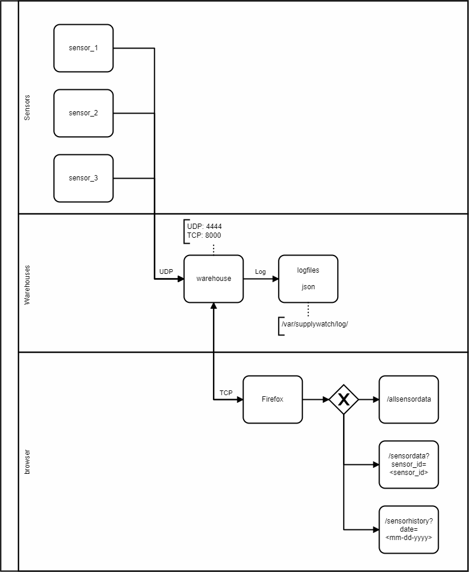

# Verteilte Systeme in Wintersemester 2021/22

## Getting Started

The easiest way to run the projekt is by using `docker-compose`

```
docker-compose up -d --build
```

## Assignment

in the context of this course we are designing a distributed system for "Supply Chain Monitoring".
Below you can find a diagram of the full project we are buidling. The goal is not to build the most
realistic supply chain monitoring but rather to focus on the communication of the distributed system,
the system design, the tests and the deployment of the application.


## Project Structure

* `build/`: defines the infrastructure
  * `<service-name>/`: define a Dockerfile for the concrete service.
* `cmd/`: entrypoints
  * `<service-name>/`: primary entrypoint for this service - short main functions.
* `internal/`: defines the _core domain_.
  * `<service-name>/`: concrete implementation of the service - source code.
* `pkg/`: code that is used by multiple services.
* `tests/`: describtions of test cases.

## Flow-Diagram



## Functional Requirements

* Zufällige Daten müssen von den Sensoren erstellt werden.
* Daten müssen via UDP von den Sensoren gesendet werden.
* Daten müssen von den Warenhäusern auf dem UDP Socket empfangen werden.
* Daten müssen von den Warenhäusern geloggt werden.
  * Geloggte Daten müssen Sensor-ID und Zeitstempel beinhalten.
  * Die Anzahl der empfangenen Daten muss geloggt werden.
* Übertragene Daten müssen nachverfolgbar sein.
* Geloggte Daten müssen über eine HTTP-Schnittstelle abrufbar sein.
* Die HTTP-Schnittstelle muss den HTTP-GET Befehl verarbeiten können.
* Die HTTP-Antwort muss im JSON-Format gesendet werden.

## Non-Functional Requirements

* Die einzelnen Komponenten des Servers sollten unabhängig voneinander laufen können.
* Die Webseite sollte von Mozilla Firefox aufrufbar sein.

## Realisierung

Die erstellten Sensoren simulieren das Einscannen von Produkten durch zufällig generierte Datenobjekte. Jeder Sensor stellt einen eigenständigen Prozess dar und ist mit folgenden Daten definiert:
* `sensor_id`: Einzigartige Identifizierung des Sensors.
* `sensor_type`: Art des Scan-Verfahrens des Sensors.
* `message`: Übertragenes Datenobjekt.
* `ip`: IP-Adresse des Sensors.
* `port`: Port-Nummer des Sensors.

Die Daten der Sensoren werden mittels UDP an die Warenhäuser übertragen.
Die Warenhäuser nehmen die Datenpakete an und speichern diese in LOG-Dateien.
Die LOG-Dateien werden pro Tag gespeichert und für spätere Verfolgung gelagert.

## HTTP-Endpoints

Folgende Links sind auf den Warenhaus-Servern via TCP (Port: 8000) erreichbar:
* `/allsensordata`: Anzeigen aller erhaltenen Sensordaten.
* `/sensordata?sensor_id=<sensor_id>`: Anzeigen der gescannten Daten von bestimmtem Sensor.
  * `<sensor_id>` muss hierbei ersetzt werden!
* `/sensorhistory?date=<mm-dd-yyyy>`: Anzeigen aller erhaltenen Sensordaten (bestimmter Tag).
  * `<mm-dd-yyyy>` muss hierbei ersetzt werden!

## Testumgebung

* Allgemein verwenden wir Docker-Compose auf einem Linux-System (Ubuntu 20.04).
* Für die HTTP-Tests wird Firefox verwendet.

## Tests

### Functional tests

Functional tests are descirbed in the `test` directory.  

  


### Unit tests

Unit tests can be executed with `make test`  
Current test coverage (29.11.2021): ~10%
