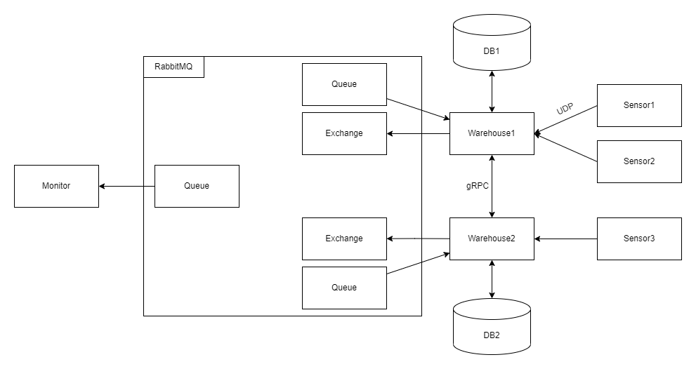

# Supplywatch

Supplywatch is a distributed system trying to simulate a supplychain.
It consists of:

* Sensors
    * Simulates random products (from a predefined list) entering or leaving a warehouse
* Warehouses
    * receives data from Sensors
    * stores the current amount of each product in a database
* Monitor
    * a central overview, here you can view the data of each warehouse

Warehouses can also ship products to other warehouses. When a warehouse has nothing left of any given prodct it will send
a message to all other warehouses (via MessageQueue) requesting said product. If any of the other warehouses has atleast
two units of that product left it will send one to the requesting warehouse (via gRPC).

## Architecture Diagramm



## Getting Started

First you need to adjust the configurations in `configurations/postgresql.env.dummy`
You can adjust all values but the only one you really should change is the `POSTGRES_PASSWORD`.
Once you are done editing save the file as `configurations/postgresql.env`

Afterwards you can start the project by simply running:

```
docker-compose up -d --build
```

## Kubernetes deployment

To make the deployment of the system as easy as possible, a helm chart has been provided
Assuming that helm is installed on your system and has been setup to communicate with your cluster you can simply run:

```
helm install supplywatch-service
```

## Project Structure

* `bin/`: Scripts to automate test
* `build/`: defines the infrastructure
  * `<service-name>/`: define a Dockerfile for the concrete service.
* `configurations/`: config files
* `charts/`: Helm Chart for kubernetes deployment
* `cmd/`: entrypoints
  * `<service-name>/`: primary entrypoint for this service - short main functions.
* `configurations/`: config files
* `internal/`: defines the _core domain_.
  * `<service-name>/`: concrete implementation of the service - source code.
  * `pb`: generated code from protobuf definitions
* `media/`: images
* `pkg/`: code that is used by multiple services.
* `proto/`: protobuf files for gRPC
* `tests/`: describtions of test cases.


## Tests

### Functional tests

Functional tests are descirbed in the `test` directory.


### Unit tests

Unit tests can be executed with `make test`
Current test coverage (29.11.2021): ~10%
